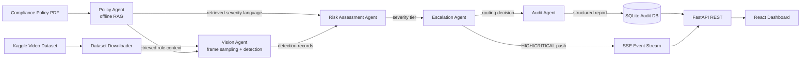
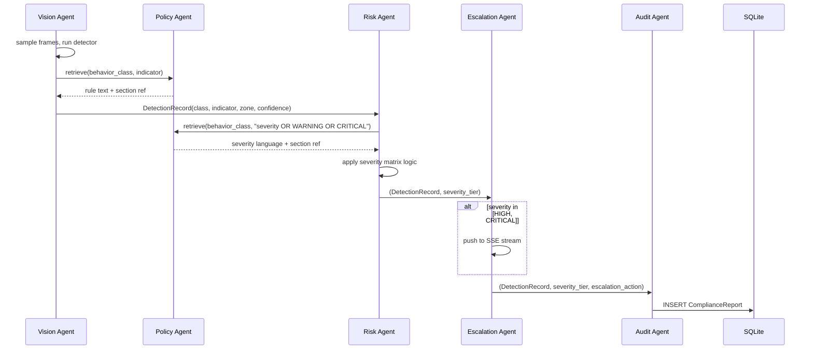

# Architecture

## 1. System overview

The system is organized as five cooperating agents inside an Agent-Based
Model (ABM), not as a linear script. Each agent owns one functional module
from the assignment brief, exposes a narrow interface to the others, and can
be tested, replaced, or re-tuned independently. A Mesa `Model` instance
schedules them once per ingested clip.



## 2. Agent responsibilities

| Agent | Module mapped | Input | Output |
|---|---|---|---|
| Policy Agent | Policy parsing / RAG | `compliance_policy.pdf` | Indexed chunks + retrieval API (`retrieve(query, k)`) |
| Vision Agent | Module 1 — Detection | Video clip + policy context | List of `DetectionRecord` |
| Risk Assessment Agent | Module 2 — Severity Matrix | `DetectionRecord` + policy severity language | Severity tier (LOW/MEDIUM/HIGH/CRITICAL) |
| Escalation Agent | Module 3 — Escalation Pipeline | Severity tier | DB-log action and/or real-time alert push |
| Audit Agent | Module 4 — Report Generation | All upstream outputs | Immutable `ComplianceReport` row |

The Operations Dashboard (Module 5) is a separate React application; it is a
*consumer* of the Audit Agent's data and the Escalation Agent's live stream,
not an ABM agent itself, since it has no autonomous decision logic of its
own.

## 3. Why Agent-Based Modeling, and which algorithm

ABM is justified here over a plain function-call pipeline for three reasons
specific to this problem:

1. **Heterogeneous, stateful actors.** The Policy Agent holds a persistent
   vector index across the whole run; the Vision Agent holds per-clip frame
   state; the Risk Agent holds an evolving severity-tier history per zone.
   Modeling each as an agent with its own internal state, rather than as a
   stateless function, mirrors how the real deployed system would scale to
   running concurrently per camera.
2. **Local decision rules composing into system behavior.** Each agent only
   needs to see its immediate inputs (e.g., the Risk Agent never touches raw
   video; it only sees detection + retrieved policy text). This is exactly
   the ABM pattern of local rules producing emergent system-level behavior
   (the final escalation decision), and it keeps the modules independently
   testable as required by the brief's "interface contracts" language.
3. **Natural extension point for swarm methods.** Because agents already
   communicate through a shared "environment" (the Mesa model's `schedule`
   and a shared blackboard dict), Section 8 below ("Swarm Intelligence
   Extensions") can plug PSO/ACO-style agents into the same loop without
   restructuring the pipeline — see `docs/SWARM_INTELLIGENCE.md`.

**Scheduler:** `mesa.time.RandomActivation`. The five agents have a strict
data dependency (Policy → Vision → Risk → Escalation → Audit) *within one
clip's processing*, but across the *batch* of clips there is no required
ordering — clip 7 does not depend on clip 3. `RandomActivation` activates one
full agent chain per scheduled step and is the lightest-weight scheduler Mesa
provides (no spatial grid, no simultaneous-state buffering), which matters
for the Green AI goal of minimal scheduling overhead. `SimultaneousActivation`
or a spatial `Grid`-based scheduler would add overhead with no benefit since
agents don't share a spatial environment in this problem. Full justification
and pseudocode in `docs/ABM_DESIGN.md`.

## 4. Data flow per clip (sequence diagram)



## 5. Repository layout

```
factory-compliance-system/
├── README.md
├── docs/
│   ├── ARCHITECTURE.md          (this file)
│   ├── ABM_DESIGN.md
│   ├── GREEN_AI.md
│   ├── SWARM_INTELLIGENCE.md
│   └── EVALUATION.md
├── config/config.yaml
├── .env.example
├── requirements.txt
├── docker-compose.yml / Dockerfile.backend / Dockerfile.frontend
├── scripts/ (setup.sh, run_backend.sh, run_dashboard.sh, download_dataset.py)
├── data/{policy, raw_clips, processed}/
├── vector_store/
├── outputs/{reports, logs}/
└── src/
    ├── policy_agent/     # Phase 2
    ├── vision_agent/     # Phase 3
    ├── abm/              # Phase 4 (Mesa model + scheduler wiring)
    ├── risk_agent/        # Phase 4
    ├── escalation_agent/  # Phase 4
    ├── audit_agent/       # Phase 5
    ├── backend/           # Phase 6 (FastAPI + SSE)
    └── dashboard/         # Phase 7 (React)
```
